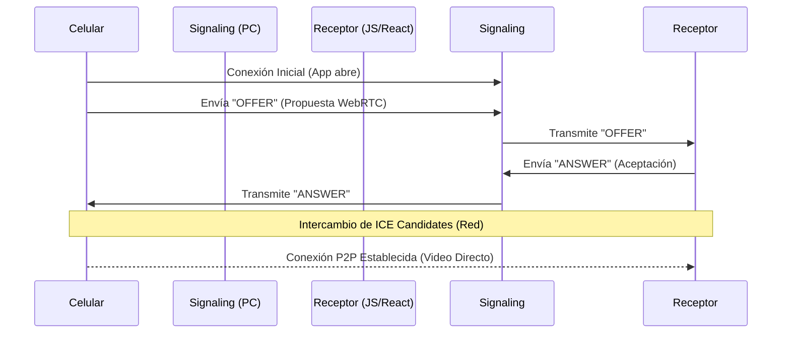

# Arquitectura de SynCam V2

SynCam V2 es un sistema de transmisión de video y audio de ultra baja latencia diseñado para convertir un dispositivo móvil en una cámara profesional para PC. A diferencia de la Versión 1 (que usaba WebSockets y JPEGs binarios), la V2 utiliza el protocolo **WebRTC**, el estándar de la industria para comunicaciones en tiempo real.

## Componentes Principales

El sistema se divide en tres partes fundamentales:

1.  **Emisor (Mobile App):**
    *   Captura video y audio nativo usando el hardware del celular.
    *   Codifica el flujo en H.264/VP8 y Opus.
    *   Negocia una conexión P2P (Peer-to-Peer) con el receptor.

2.  **Receptor (Desktop App):**
    *   Aplicación basada en **Electron** que aloja la interfaz de visualización.
    *   Renderiza el flujo de video recibido con latencia mínima (<150ms).
    *   Actúa como servidor de señalización (Signaling).

3.  **Servidor de Señalización (Signaling Server):**
    *   Implementado con **Socket.io** dentro del proceso principal de Electron.
    *   Su función es permitir que el celular y la PC se "encuentren" y compartan sus capacidades (SDP) y direcciones de red (ICE Candidates).
    *   **Nota:** Una vez establecida la conexión WebRTC, el tráfico de video NO pasa por este servidor; va directo de celular a PC.

## Flujo de Conexión

## Ventajas Tecnológicas

*   **Baja Latencia:** El uso de UDP y protocolos de tiempo real permite una sincronización casi instantánea.
*   **Eficiencia:** El hardware del celular se encarga de la compresión, liberando carga en la PC.
*   **Audio Sincronizado:** WebRTC maneja tracks de audio y video de forma simultánea y sincronizada de fábrica.
